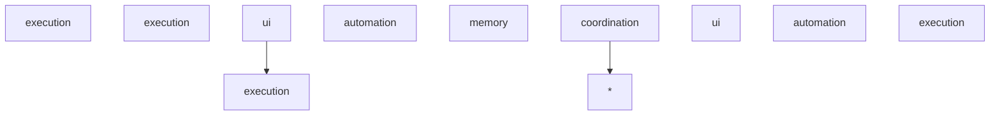

# nexus-core Dependency Graph

```mermaid
graph TD
  autonomous-github-agent[execution]
  singularity-operator[execution]
  self-evolve-dash[execution]
  nexus-infinity-hub[ui]
  collabhub-modules[automation]
  VectorFS[memory]
  AI-Collaboration-Hub[coordination]
  third-door-blink-controller[ui]
  third-door-system[automation]
  solutions-dynamics[execution]
  nexus-infinity-hub --> self-evolve-dash
  AI-Collaboration-Hub --> *
```

Generated by nexus-core. Enforce via CI.
