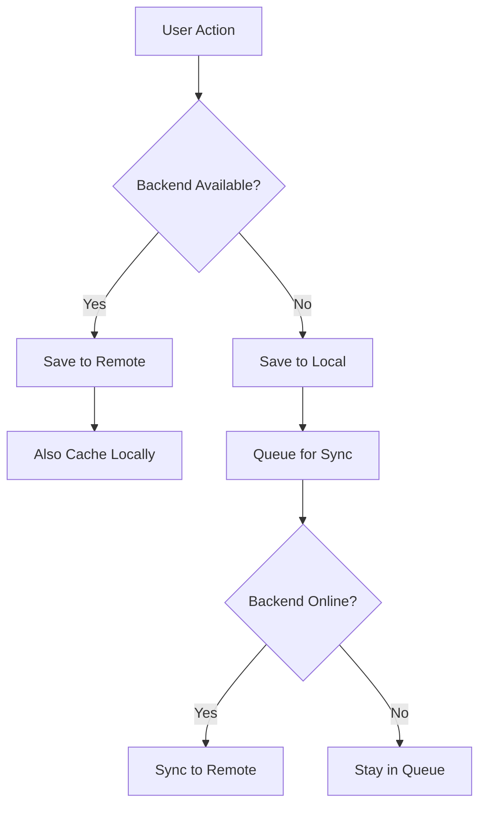

# 🌐 Offline Mode & Zero-Cost Operation

## Overview

The system now features a **complete offline-first architecture** that works without any backend connection. This means **ZERO cloud costs** and full functionality even when your Supabase backend is paused or unavailable.

## 🎯 Key Features

### 1. **Hybrid Data Management**
- **Automatic Fallback**: Seamlessly switches between remote (Supabase) and local (browser storage) based on backend availability
- **Zero Latency**: Local operations are instant - no network delays
- **Auto-Sync**: When backend comes back online, changes sync automatically

### 2. **Three Storage Modes**

#### Remote Mode
- All data stored in Supabase cloud
- Requires active backend connection
- Best for: Multi-device access and team collaboration

#### Hybrid Mode (Recommended)
- Automatically uses remote when available
- Falls back to local when backend is offline
- Best for: Reliable operation with cloud benefits

#### Local Mode
- All data stored in browser (localStorage)
- Works completely offline
- **Zero backend costs**
- Best for: Personal use, privacy, offline work

### 3. **Data Persistence**
All system data is preserved locally:
- ✅ Scripts and code
- ✅ Activity logs
- ✅ AI improvements
- ✅ System settings
- ✅ Sync queue for pending changes

### 4. **Export & Import**
- **Export**: Download complete backup as JSON
- **Import**: Restore from any backup file
- Perfect for migrating between browsers or sharing configurations

## 📊 How It Works



## 🚀 Usage

### Accessing Offline Mode
1. Navigate to the **"Offline Mode"** tab in the dashboard
2. Choose your preferred storage mode
3. Monitor sync status and pending changes

### Managing Data

#### Export Backup
```
1. Go to Offline Mode tab
2. Click "Export Data"
3. Save JSON file to your computer
```

#### Import Backup
```
1. Go to Offline Mode tab
2. Click "Import Data"
3. Select your backup JSON file
```

#### Manual Sync
```
1. Check pending sync count
2. Click "Sync Now" when backend is online
3. All queued changes upload to cloud
```

## 💡 Use Cases

### 1. **Backend Paused (Zero Cost)**
Perfect when you don't want to pay for cloud resources:
- Switch to **Local Mode**
- Continue using all features
- Export backups regularly
- No functionality lost

### 2. **Intermittent Connection**
Working on the go with spotty internet:
- Use **Hybrid Mode**
- Work offline when needed
- Auto-sync when connection returns
- Never lose progress

### 3. **Privacy-Focused**
Keep all data on your device:
- Use **Local Mode**
- No data leaves your browser
- Complete control over your information
- Export/import for backups

### 4. **Multi-Device Setup**
Want cloud sync when available:
- Use **Remote** or **Hybrid Mode**
- Access from multiple devices
- Automatic synchronization
- Fallback to local if needed

## 🔒 Data Structure

### Local Storage Keys
```javascript
{
  "autonomous_scripts": [],         // Your scripts
  "autonomous_activity_logs": [],   // Activity history
  "autonomous_improvements": [],    // AI suggestions
  "autonomous_settings": {},        // App configuration
  "autonomous_sync_queue": [],      // Pending syncs
  "autonomous_last_sync": ""        // Last sync timestamp
}
```

### Export Format
```json
{
  "scripts": [...],
  "activityLogs": [...],
  "improvements": [...],
  "settings": {...},
  "exportedAt": "2024-01-01T00:00:00.000Z"
}
```

## ⚙️ Technical Details

### Storage Capacity
- **localStorage**: ~5-10MB per domain
- **Sufficient for**: Thousands of scripts and logs
- **Compression**: JSON format is text-efficient
- **Cleanup**: Old logs auto-pruned to top 100

### Browser Compatibility
- ✅ Chrome/Edge
- ✅ Firefox
- ✅ Safari
- ✅ All modern browsers with localStorage support

### Data Persistence
- ✅ Survives browser restart
- ✅ Survives page refresh
- ✅ Per-domain isolation
- ❌ Lost if browser cache cleared (export backups!)

## 🛡️ Best Practices

1. **Regular Backups**
   - Export your data weekly
   - Store backups in cloud storage (Google Drive, Dropbox, etc.)
   - Keep multiple versions

2. **Hybrid Mode**
   - Use hybrid mode as default
   - Get cloud benefits when available
   - Automatic offline fallback

3. **Monitor Sync Queue**
   - Check pending changes regularly
   - Sync when you have good connection
   - Clear queue to free up space

4. **Browser Cache**
   - Don't clear browser data without exporting first
   - Be careful with "Clear browsing data" options
   - Exclude site data if you must clear cache

## 🔄 Migration Scenarios

### From Remote to Local
```
1. Switch to "Hybrid Mode" first
2. Let it sync and cache all data
3. Export a backup (safety)
4. Switch to "Local Mode"
5. Pause your Supabase project
```

### From Local to Remote
```
1. Ensure backend is running
2. Switch to "Hybrid Mode"
3. Click "Sync Now"
4. Verify all data synced
5. Switch to "Remote Mode" if desired
```

### Between Browsers
```
1. Export from Browser A
2. Save backup file
3. Open app in Browser B
4. Import backup file
5. Continue working
```

## 📈 Performance Comparison

| Operation | Remote | Hybrid | Local |
|-----------|--------|--------|-------|
| Read Speed | 200-500ms | 1-5ms | 1-5ms |
| Write Speed | 200-500ms | 1-5ms | 1-5ms |
| Offline Work | ❌ No | ✅ Yes | ✅ Yes |
| Multi-Device | ✅ Yes | ✅ Yes | ❌ No |
| Cloud Cost | 💰 Paid | 💰 Paid | 🆓 Free |
| Privacy | ☁️ Cloud | 🔄 Both | 🔒 Local |

## 🎉 Benefits Summary

### Zero Cost Operation
- ✅ No backend required
- ✅ No cloud expenses
- ✅ No usage limits
- ✅ Full functionality

### Maximum Privacy
- ✅ Data stays on your device
- ✅ No server uploads
- ✅ Complete control
- ✅ GDPR compliant

### Best Performance
- ✅ Instant responses
- ✅ No network latency
- ✅ Works offline
- ✅ Reliable operation

### Future-Proof
- ✅ Export/import anytime
- ✅ Migrate between systems
- ✅ Backup friendly
- ✅ Platform independent

---

**Ready to go offline?** Switch to Local Mode and enjoy zero-cost autonomous AI! 🚀
